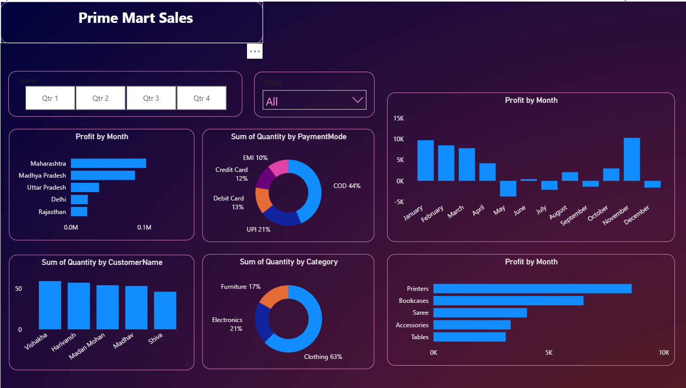

# PrimeMart Sales Dashboard

## Overview
This is an interactive Power BI dashboard created for PrimeMart to analyze sales performance and business insights using sample data.

## Features
- Sales Overview
- Profit Analysis
- Category-wise Performance
- Regional Sales Analysis
- Interactive Filters and Slicers
- KPI Cards

## Tools Used
- Power BI
- Microsoft Excel

## Dataset
This project uses fictional data created for learning and portfolio purposes.

## Dashboard Preview

## Author
Shubham Talekar
